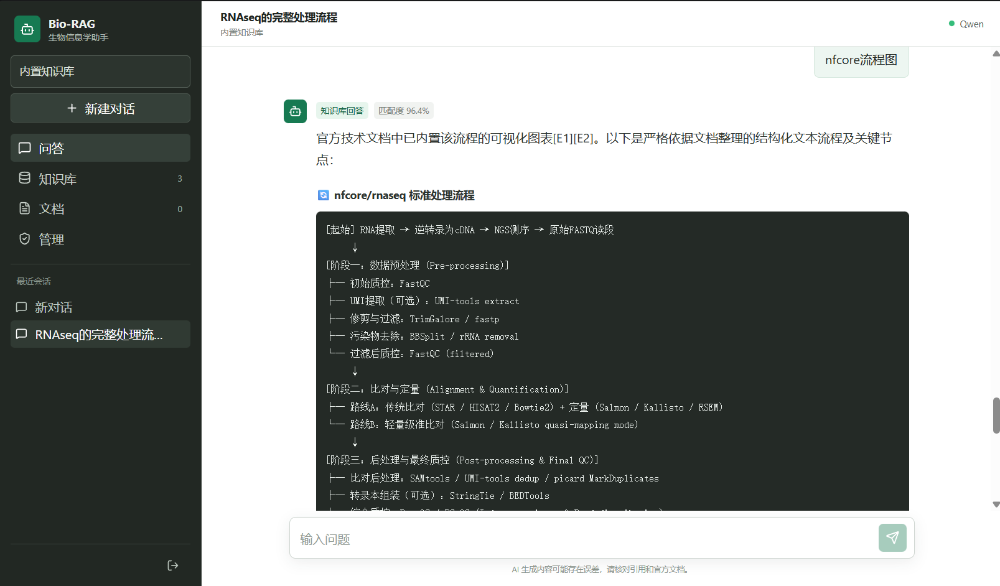
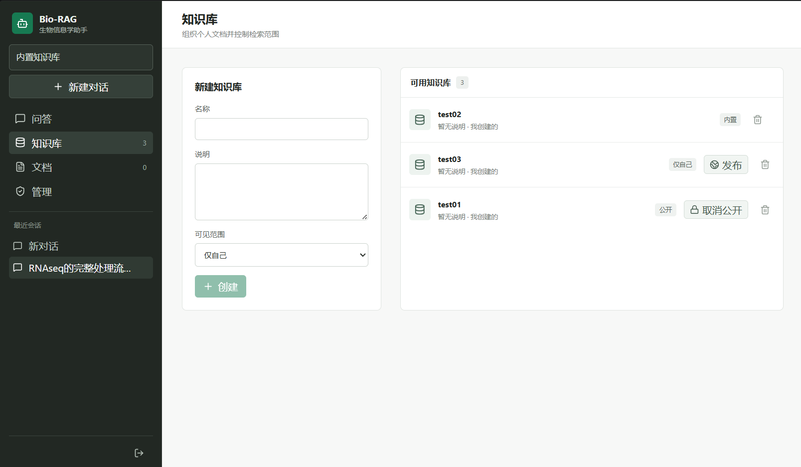
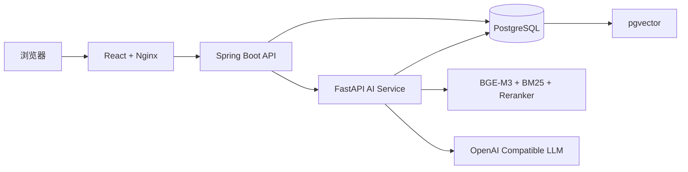

# Bio RAG

Bio RAG 是一个面向生物信息学资料的自托管 RAG 问答系统。它支持上传 PDF、DOCX、HTML、Markdown、RST 和 TXT 文档，将资料解析为可追溯的知识库，并通过混合检索、重排序和大语言模型生成带引用的回答。


## 目录

- [核心特性](#核心特性)
- [界面预览](#界面预览)
- [快速开始](#快速开始)
- [使用流程](#使用流程)
- [系统架构](#系统架构)
- [镜像与部署](#镜像与部署)
- [配置说明](#配置说明)
- [数据持久化](#数据持久化)
- [本地开发](#本地开发)
- [常见问题](#常见问题)
- [许可证](#许可证)

## 核心特性

- **文档知识库**：支持 PDF、DOCX、HTML、Markdown、RST 和 TXT，上传后自动解析、切分、向量化并入库。
- **批量上传**：一次选择多个文档，按顺序逐个索引；单个文件失败不会中断整批任务，并可单独重试失败项。
- **混合检索**：结合 BGE-M3 语义向量检索、BM25 关键词检索和 RRF 融合，兼顾语义问题与专业术语、命令参数、文件名等精确匹配。
- **Reranker 重排序**：使用 BGE Reranker 对候选证据再次排序，提升最终送入 LLM 的上下文质量。
- **可追溯回答**：回答携带来源、章节、页码、证据分数和关联图片，便于回到原文核对。
- **图片资产返回**：解析文档中的位图和图表引用，用户询问原图、流程图或示意图时可返回关联图片。
- **多轮会话**：保留上下文，自动改写包含“它”“这个方法”等指代的问题，再进入检索流程。
- **多知识库问答**：一次会话可选择多个知识库，支持私有、公开和系统内置知识库。
- **用户与管理员**：提供注册登录、Session 鉴权、用户管理、管理员内置知识库管理等基础能力。
- **OpenAI 兼容 LLM**：可接入 Qwen、DeepSeek 或其他兼容 OpenAI Chat Completions 风格的模型服务。

## 界面预览

### 知识库增强问答

系统会结合知识库证据生成回答，并展示匹配度、引用来源和结构化内容。



### 知识库管理

用户可以创建私有或公开知识库，管理员可以维护所有用户可用的内置知识库。



## 快速开始

### 准备条件

- Docker Desktop，或 Docker Engine + Docker Compose v2
- 一个兼容 OpenAI API 格式的 LLM 服务
- 可访问 GHCR；模型下载默认使用 `hf-mirror.com`，可在 `.env` 中替换
- NVIDIA GPU 为可选项，CPU 镜像可直接运行

### 1. 克隆项目

```bash
git clone https://github.com/Ymomo178/Bio_RAG.git
cd Bio_RAG
```

### 2. 创建环境变量文件

Windows PowerShell：

```powershell
Copy-Item .env.example .env
```

macOS / Linux：

```bash
cp .env.example .env
```

打开 `.env`，至少填写：

```env
LLM_PROVIDER=qwen
LLM_BASE_URL=https://你的服务地址/compatible-mode/v1
LLM_API_KEY=你的 API Key
LLM_MODEL=你的模型名称
APP_ADMIN_EMAIL=你的管理员邮箱
```

`APP_ADMIN_EMAIL` 对应的账号在注册或登录后会获得管理员权限。

### 3. 一键启动（Windows）

配置完成后，直接双击项目根目录中的文件：

| 文件 | 用途 |
| --- | --- |
| `start.bat` | 默认 CPU 模式启动，并自动打开网页 |
| `start-gpu.bat` | 使用 NVIDIA GPU 启动 |
| `stop.bat` | 停止服务，保留数据库、模型缓存和上传文件 |

启动脚本会自动启动 Docker Desktop、等待容器就绪并处理端口冲突。如果 `5173` 已被其他程序占用，脚本会选择空闲端口并打开正确地址。

### 4. 使用命令行启动

默认 CPU 模式：

```bash
docker compose -f docker-compose.images.yml up -d
```

NVIDIA GPU 模式：

```bash
docker compose -f docker-compose.images.yml -f docker-compose.gpu.yml up -d
```

查看服务状态：

```bash
docker compose -f docker-compose.images.yml ps
```

访问网页：

```text
http://localhost:5173
```

首次问答或首次上传文档时，系统会下载 BGE-M3 和 BGE Reranker 模型。模型会缓存到 Docker 数据卷，后续启动可复用。

## 使用流程

1. 注册账号并登录。
2. 创建知识库，选择私有或公开；管理员可维护系统内置知识库。
3. 上传单个或多个文档，等待文档状态变为可检索。
4. 新建会话，选择一个或多个知识库。
5. 提问并查看回答、引用来源、页码和关联图片。

新部署不会包含仓库作者本地的原始文档、上传文件或模型缓存，请在网页中上传自己的资料。

## 系统架构



一次问答的核心链路：

```text
用户问题 + 会话历史
        ↓
上下文改写为独立问题
        ↓
BGE-M3 向量召回 + BM25 关键词召回
        ↓
RRF 融合候选证据
        ↓
BGE Reranker 重排序
        ↓
证据阈值判断
        ↓
知识库增强回答 / 通用知识兜底回答
```

浏览器只访问 Web 服务。Web 将 `/api` 请求转发给 Java 后端；Java 管理用户、权限、知识库、文档和会话；Python 负责文档解析、检索、重排和 LLM 生成；PostgreSQL 同时保存业务数据和 pgvector 向量。

## 镜像与部署

| 服务 | 镜像 | 说明 |
| --- | --- | --- |
| Web | `ghcr.io/ymomo178/bio-rag-web:latest` | React 静态资源和 Nginx 反向代理 |
| Backend | `ghcr.io/ymomo178/bio-rag-backend-java:latest` | Spring Boot 业务后端 |
| AI CPU | `ghcr.io/ymomo178/bio-rag-ai-service:latest` / `:cpu` | 默认 AI 服务镜像，无需 GPU |
| AI CUDA | `ghcr.io/ymomo178/bio-rag-ai-service:cuda` | CUDA 12.4 镜像，需要 NVIDIA 容器运行时 |
| Database | `pgvector/pgvector:pg17` | PostgreSQL 17 + pgvector |

更新预构建镜像：

```bash
docker compose -f docker-compose.images.yml pull
docker compose -f docker-compose.images.yml up -d
```

停止服务但保留数据：

```bash
docker compose -f docker-compose.images.yml down
```

从源码构建全部服务：

```bash
docker compose up -d --build
```

从源码构建并启用 GPU：

```bash
docker compose -f docker-compose.yml -f docker-compose.gpu.yml up -d --build
```

## 配置说明

常用配置位于 `.env`：

| 变量 | 说明 | 默认值或要求 |
| --- | --- | --- |
| `LLM_PROVIDER` | LLM 提供方标识 | `qwen` |
| `LLM_BASE_URL` | OpenAI 兼容 API 根地址 | 必填 |
| `LLM_API_KEY` | LLM 服务密钥 | 必填 |
| `LLM_MODEL` | 对话模型名称 | 必填 |
| `APP_ADMIN_EMAIL` | 管理员邮箱 | 必填 |
| `POSTGRES_PASSWORD` | PostgreSQL 密码 | 本地默认 `biorag_dev` |
| `HF_ENDPOINT` | Hugging Face 下载端点 | `https://hf-mirror.com` |
| `EMBEDDING_MODEL` | Embedding 模型 | `BAAI/bge-m3` |
| `RERANKER_MODEL` | Reranker 模型 | `BAAI/bge-reranker-v2-m3` |
| `MIN_EVIDENCE_SCORE` | 使用知识库证据的最低分数 | `0.85` |
| `MAX_FILE_SIZE` | 单文件上传限制 | `25MB` |
| `SESSION_COOKIE_SECURE` | 是否仅通过 HTTPS 发送 Cookie | 本地 HTTP 使用 `false` |

容器内部会自动使用 Compose 服务名连接 PostgreSQL。仅当你在宿主机直接运行 Java 或 Python 时，才需要使用 `.env` 中的 `localhost` 数据库地址。

## 数据持久化

| 数据 | 位置 |
| --- | --- |
| 用户、会话、知识库、文档元数据和向量 | Docker 卷 `postgres_data` |
| BGE-M3 与 Reranker 模型缓存 | Docker 卷 `model_cache` |
| 用户上传的原始文件 | `uploads/` |
| 规范化文档和图片资产 | `artifacts/` |

以下内容不会提交到 Git：`.env`、`uploads/`、`artifacts/`、`data/raw/`、`data/normalized/`、`data/chunks/`、`data/indexes/` 和本地模型缓存。

谨慎使用：

```bash
docker compose -f docker-compose.images.yml down -v
```

该命令会删除数据库和模型缓存卷。

## 本地开发

需要分别调试前端、Java 或 Python 时，安装：

- Java 21
- Python 3.12
- Node.js 20+
- Docker Desktop

启动数据库：

```bash
docker compose up -d postgres
```

启动 Java 后端：

```powershell
cd backend-java
.\mvnw.cmd spring-boot:run
```

启动 Python AI 服务（CPU 示例）：

```powershell
cd ai-service-python
python -m venv .venv
.\.venv\Scripts\python.exe -m pip install "torch==2.6.0" --index-url https://download.pytorch.org/whl/cpu
.\.venv\Scripts\python.exe -m pip install -e ".[embedding,service,dev]"
.\.venv\Scripts\biorag-api.exe
```

启动前端：

```powershell
cd web
npm ci
npm run dev
```

默认端口：

| 服务 | 地址 |
| --- | --- |
| Web | `http://localhost:5173` |
| Java API | `http://localhost:8080` |
| Python AI | `http://localhost:8000` |
| PostgreSQL | `localhost:5432` |

运行检查：

```powershell
cd backend-java
.\mvnw.cmd test

cd ..\ai-service-python
.\.venv\Scripts\python.exe -m pytest -q

cd ..\web
npm run build
```

## 项目结构

```text
Bio_RAG/
├── web/                       # React 前端和 Nginx 配置
├── backend-java/              # Spring Boot 业务 API
├── ai-service-python/         # FastAPI、文档处理、检索和生成
├── infra/postgres/            # PostgreSQL / pgvector 初始化脚本
├── data/evaluation/           # 检索和无答案评测集
├── reports/                   # 评测报告
├── docker-compose.images.yml  # 预构建镜像启动配置
├── docker-compose.gpu.yml     # GPU 覆盖配置
└── docker-compose.yml         # 本地源码构建配置
```

## 常见问题

### GHCR 镜像拉取失败

如果提示 `401`、`denied` 或 `manifest unknown`，确认 GitHub Packages 中的三个容器包已经设为 Public。私有包需要先执行 `docker login ghcr.io`。

### 拉取镜像时出现 `EOF` 或 `Connection reset`

通常是 Docker Desktop 到 GHCR 的网络或代理问题。确认 Docker Desktop 代理设置与系统代理一致，重启 Docker Desktop 后再单独运行 `docker pull` 验证。

### 端口被占用

在 `.env` 中修改 `WEB_PORT`、`JAVA_PORT`、`PYTHON_PORT` 或 `POSTGRES_PORT`，然后重新启动 Compose。

### 页面提示 AI 服务不可用

先检查容器状态和日志：

```bash
docker compose -f docker-compose.images.yml ps
docker compose -f docker-compose.images.yml logs --tail=200 ai-service
docker compose -f docker-compose.images.yml logs --tail=200 backend-java
```

重点确认 LLM 配置完整、PostgreSQL 健康、模型下载成功，并检查 Python 服务是否因内存不足退出。

### 首次问答很慢

首次请求会下载并加载 Embedding 与 Reranker 模型。下载完成后模型会保存在 `model_cache` 卷中，后续启动会复用缓存。

## 安全与免责声明

- `.env` 中的 API Key、数据库密码和管理员邮箱不应提交到 Git。
- 默认数据库密码仅适合本地开发；部署到共享或公网环境前应修改。
- 通过 HTTPS 对外提供服务时，将 `SESSION_COOKIE_SECURE=true`。
- 模型回答可能存在错误。涉及实验设计、临床医学或其他高风险决策时，请以原始文献、官方文档和专业人员判断为准。

## 许可证

本项目基于 [MIT License](LICENSE) 开源。
