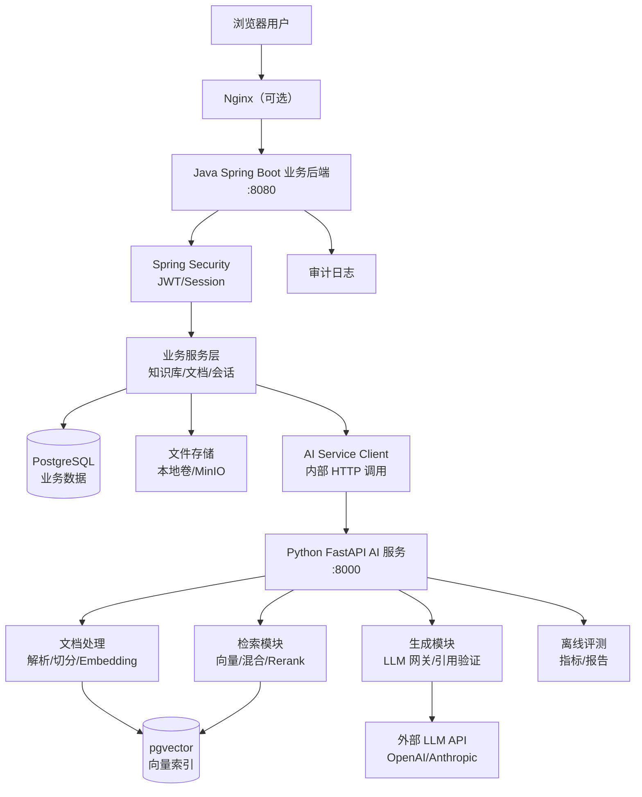
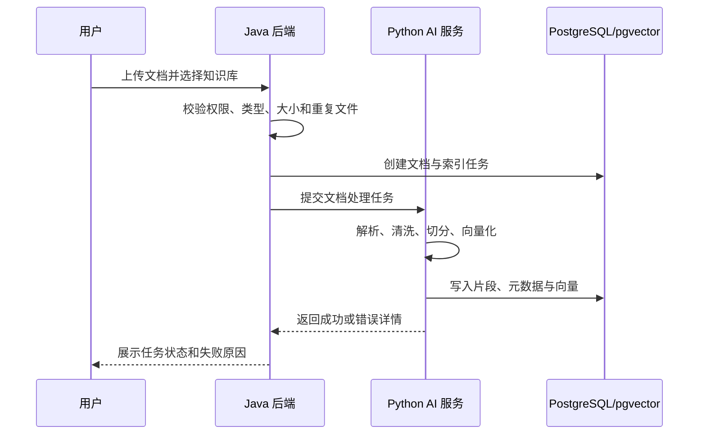

# Bio RAG：生物医药知识库与分析解读平台

> 当前状态：网页、Java、Python、PostgreSQL/pgvector、文档入库、混合检索、Reranker、Qwen 生成、会话记忆和权限管理已端到端贯通。

当前可用功能：

- 会话历史和上下文记忆，生成状态按会话隔离；
- 一个会话可同时选择多个有权访问的知识库；
- PDF、DOCX、HTML、Markdown、RST、TXT 上传、切分、向量化和检索；
- 私人知识库发布/取消公开，其他登录用户只读使用；
- 引用页码、章节及关联原图查看；
- Markdown 标题、列表、表格、代码块等结构化回答；
- `USER/ADMIN` 角色、用户启停和系统内置知识库维护。

## 0. 从这里开始

这是一个单仓库多服务项目，根目录不需要创建 Maven 工程：

- `backend-java/` 是独立 Maven 工程，使用仓库自带的 Maven Wrapper；
- `ai-service-python/` 使用 `pyproject.toml` 独立管理；
- `web/` 使用 React、TypeScript 和 Vite；
- 根目录负责 Docker Compose、跨服务脚本和项目文档。

本地开发需要 Java 21、Docker Desktop、Node.js 20+ 和 Python 3.12。Windows PowerShell 首次验证 Java 后端：

```powershell
# JAVA_HOME 必须指向 JDK 根目录，而不是它的上一级目录
$env:JAVA_HOME = 'C:\path\to\jdk-21'

docker compose up -d postgres
cd backend-java
.\mvnw.cmd test
.\mvnw.cmd spring-boot:run
```

另外两个终端分别启动 Python 和网页：

```powershell
cd ai-service-python
.\.venv\Scripts\biorag-api.exe

cd web
npm install
npm run dev -- --host 127.0.0.1
```

启动后可访问：

- 后端健康检查：`http://localhost:8080/api/v1/system/health`
- Python 健康检查：`http://localhost:8000/health`
- 网页入口：`http://localhost:5173`

管理员由根目录 `.env` 中的 `APP_ADMIN_EMAIL` 指定。填写已注册邮箱后重新登录，系统会自动授予 `ADMIN` 角色；管理员可在网页“管理”入口维护用户，并创建 `系统内置` 知识库后上传文档。

## 1. 项目定位

Bio RAG 面向生物信息分析人员、实验室成员和生物医药研发团队，用于管理方法文档、软件手册、公开数据库说明和内部 SOP，并提供带来源引用的专业问答。

项目不是普通的“上传 PDF 聊天”演示。首版重点证明以下能力：

- Java 企业后端设计与数据库建模
- Python AI 服务与 Java 服务联调
- 文档解析、混合检索、Rerank 和引用溯源
- 权限、反馈、审计和异步任务
- RAG 离线评测、错误分析和可部署性

## 2. 用户与应用场景

### 目标用户

- 需要查询分析流程和参数依据的生信分析人员
- 需要维护团队 SOP 的实验室管理员
- 需要复用内部技术资料的生物医药研发团队

### 典型问题

- “Bulk RNA-seq 差异分析前为什么需要过滤低表达基因？”
- “这个 QC 指标异常时，应优先检查哪些环节？”
- “某工具的两个参数分别适用于什么场景？”
- “团队当前 SOP 与旧版在质控步骤上有什么变化？”
- “请根据知识库整理一份分析前检查清单，并标注依据。”

### 项目边界

系统只根据已授权、已入库的资料提供辅助信息，不生成临床诊断，不把模型回答当作实验或医疗结论。找不到可靠依据时必须明确拒答。

## 3. 总体架构



### 架构关键点

1. **职责分离**：
   - Java 后端：用户认证、权限、业务实体管理、事务控制
   - Python 服务：文档处理、向量检索、模型调用、RAG 评测
   - 浏览器只与 Java 通信，Python 作为内部服务不对外暴露

2. **数据库设计**：
   - PostgreSQL：业务表（用户、知识库、文档、会话、反馈、审计）
   - pgvector：向量索引表（chunks、embeddings、metadata）
   - 两者可共用一个 PostgreSQL 实例，使用不同 schema 或数据库

3. **调用链路**：
   - 同步场景：`Browser → Java → Python → LLM → Python → Java → Browser`
   - 异步场景：`Java` 提交任务 → `Python` 后台处理 → 更新状态 → `Java` 轮询/通知

4. **契约管理**：
   - Java DTO 与 Python Pydantic Schema 需保持一致
   - 建议导出 OpenAPI 规范并进行契约测试

5. **安全与权限**：
   - Java 层验证用户是否有权访问目标知识库
   - Python 层再次验证 chunk 所属知识库权限（纵深防御）
   - API Key 只从环境变量读取，不写入日志

## 4. 服务职责

### Java 后端：`backend-java`

建议技术栈：Java 21、Spring Boot 3、Spring Web、Spring Validation、Spring Security、JPA/MyBatis 二选一、Flyway、PostgreSQL、JUnit 5、Testcontainers。

职责：

- 用户注册/登录、JWT 或 Session 鉴权
- 角色与知识库访问权限
- 知识库、文档、会话、反馈等业务实体管理
- 文档上传、格式与大小校验、任务状态查询
- 统一调用 Python AI 服务
- 事务、幂等、异常映射、日志和审计
- Swagger/OpenAPI 文档和健康检查

首版不要上复杂微服务。Java 后端保持单体分模块结构，更容易完成和测试。

### Python AI 服务：`ai-service-python`

建议技术栈：Python 3.12、FastAPI、Pydantic、SQLAlchemy/psycopg、LangChain 或 LlamaIndex 选一个、pytest。

职责：

- PDF、Word、Markdown、TXT 文档解析
- 文本清洗、结构识别、切分和元数据绑定
- Embedding 和索引写入
- 关键词检索、向量检索、融合与 Rerank
- 模型调用网关：超时、限流、有限重试、模型切换和用量记录
- Prompt 构建、结构化答案生成、引用绑定和拒答
- RAG 离线评测与诊断

### Web 前端：`web`

项目只保留 React + Vite 网页端，浏览器统一访问 Java 后端。当前包含：

- 登录页
- 持久化会话列表和多轮问答
- 知识库创建、列表和删除
- 文档上传、处理状态和删除
- 知识库引用详情

### 基础设施：`infra`

- Docker Compose
- PostgreSQL + pgvector
- 本地文件卷；后续可替换为 MinIO
- 可选 Redis，用于任务队列或缓存，不作为首版强制要求

## 5. 核心业务流程

### 5.1 文档入库



关键要求：

- 使用文件哈希识别重复上传。
- 每个片段保留知识库、文档、版本、标题、页码/章节等元数据。
- 文档更新时创建新版本，不静默覆盖旧索引。
- 处理失败可重试，重复请求不能产生重复片段。

### 5.2 问答与引用

1. Java 校验用户是否有权访问目标知识库。
2. Java 将问题、知识库范围和会话上下文发送给 Python。
3. Python 进行问题预处理和检索。
4. 关键词检索与向量检索结果融合。
5. Rerank 选择最终上下文。
6. 模型只能基于上下文回答，并输出引用标识。
7. Python 校验引用是否真实存在，将答案和证据返回 Java。
8. Java 保存消息、模型信息、耗时和引用快照。
9. 用户可对答案反馈，并填写错误原因。

### 5.3 拒答

以下情况必须拒答或提示证据不足：

- 检索不到达到阈值的片段
- 问题超出当前知识库范围
- 模型回答无法绑定到有效引用
- 用户试图访问无权限知识库
- 问题要求临床诊断或确定性医疗结论

### 5.4 结构化输出与模型调用

Java 不能直接消费模型返回的任意文本。Python AI 服务将模型输出约束为版本化 Schema，例如：

```json
{
  "schema_version": "1.0",
  "answer": "根据资料……",
  "citations": [
    {
      "chunk_id": "chunk_001",
      "document_id": "doc_001",
      "page": 12,
      "quote": "支持该结论的原文片段"
    }
  ],
  "abstained": false,
  "abstain_reason": null
}
```

工程规则：

- 模型支持原生结构化输出时优先使用；否则使用 JSON Schema 约束。
- 返回结果必须通过 Pydantic 校验，并验证引用 ID、权限和原文一致性。
- Schema 失败最多重试 2 次；仍失败则返回明确错误，不能用正则猜测字段。
- 重试只修复格式，不允许改变用户权限、知识库范围和检索证据。
- 每次调用记录 provider、model、Prompt 版本、输入/输出 Token、延迟、重试次数和错误码。
- API Key 只从环境变量读取，日志不得记录密钥和完整敏感文档。

## 6. 功能分级

### P0：最小可用版本

- 用户登录和两种角色：管理员、普通用户
- 创建知识库并上传 PDF/Markdown/TXT
- 查看文档处理状态和错误原因
- 基础文本切分、Embedding 和向量检索
- 先建立只使用向量检索的 Baseline，并保存第一版评测结果
- 多知识库联合问答
- 答案展示文档名、页码/章节和引用片段
- 结构化答案 Schema、Pydantic 校验和失败重试
- 模型调用超时、错误码和 Token/延迟记录
- 问答历史与赞/踩反馈
- Docker 启动数据库和两个后端服务

### P1：简历完整版本

- Word 解析与表格文本处理
- BM25/全文检索 + 向量检索实验，通过评测决定默认是否启用
- Rerank 实验，通过检索精度、延迟和成本对比决定默认是否启用
- 无依据拒答
- 文档版本管理
- 知识库成员与权限
- 文件去重和索引任务重试
- RAG Baseline、单变量实验、回归评测面板或报告
- 审计日志、统一错误码和接口限流

### P2：时间允许再做

- 新旧文档差异对比
- 流式回答
- 查询改写和多轮问题消歧
- MinIO 文件存储
- Redis 缓存与异步任务队列
- 语义缓存、多模型路由和本地 vLLM 部署实验

## 7. 数据模型草案

| 实体 | 关键字段 | 说明 |
| --- | --- | --- |
| `users` | id、email、password_hash、status | 用户账号 |
| `roles` / `user_roles` | role、user_id | 权限角色 |
| `knowledge_bases` | id、name、owner_id、visibility | 知识库 |
| `kb_members` | kb_id、user_id、permission | 知识库级权限 |
| `documents` | id、kb_id、name、hash、status | 文档主记录 |
| `document_versions` | document_id、version、storage_path | 版本记录 |
| `chunks` | document_version_id、content、page、metadata、embedding | 可检索片段 |
| `index_jobs` | document_version_id、status、error、attempts | 异步索引任务 |
| `conversations` | id、user_id、kb_id | 会话 |
| `messages` | conversation_id、role、content、latency | 消息 |
| `citations` | message_id、chunk_id、score、snapshot | 回答引用 |
| `feedback` | message_id、rating、reason | 用户反馈 |
| `audit_logs` | actor、action、resource、result | 审计记录 |

真实实现前先画 ER 图，再通过 Flyway 管理数据库迁移。

## 8. API 边界草案

### 前端调用 Java

```text
POST   /api/auth/login
POST   /api/knowledge-bases
GET    /api/knowledge-bases
POST   /api/knowledge-bases/{kbId}/documents
GET    /api/documents/{documentId}
GET    /api/index-jobs/{jobId}
POST   /api/conversations
POST   /api/conversations/{id}/messages
POST   /api/messages/{id}/feedback
GET    /api/admin/evaluations/{runId}
```

### Java 内部调用 Python

```text
POST   /internal/v1/index-jobs
GET    /internal/v1/index-jobs/{jobId}
POST   /internal/v1/retrieve
POST   /internal/v1/answer
POST   /internal/v1/evaluations
GET    /internal/v1/health
```

内部接口使用明确的版本号和 Pydantic/Java DTO，禁止以任意字典长期传递数据。Java 与 Python 的契约应保存为 OpenAPI 或 JSON Schema，并做契约测试。

## 9. RAG 流程设计

### 索引阶段

1. 读取并验证文件。
2. 提取标题、章节、页码、表格说明等结构。
3. 清理页眉页脚和异常空白，但保留专业符号。
4. 采用“章节优先 + 长度限制”的切分策略。
5. 给每个片段绑定完整元数据。
6. 批量生成 Embedding。
7. 写入向量和全文检索索引。
8. 记录解析器、切分参数和 Embedding 模型版本。

### 查询阶段

1. 校验问题、会话和知识库权限；必要时先做消歧。
2. 应用知识库、文档类型、版本等元数据过滤。
3. Baseline 只执行向量召回，并记录 top-K 结果和各阶段耗时。
4. 实验版本可并行执行 BM25，通过 RRF 融合候选；必须与 Baseline 对比。
5. 只有在“召回已足够但排序/噪声仍差”时实验 Rerank，不能把它当默认答案。
6. 在 Token 预算内构建 Context，保留来源分隔、页码和片段 ID。
7. 通过结构化输出生成回答、引用和拒答字段。
8. 验证引用存在、权限正确且原文能够支持回答。
9. 证据不足、引用无效或输出校验失败时拒答。

### 模型与 Prompt 网关

模型调用必须集中在网关层，业务代码不得散落厂商 SDK：

- 定义统一的 `generate_structured()` 和 `embed()` 接口。
- 区分可重试错误：限流、临时网络故障、服务端错误。
- 区分不可重试错误：鉴权失败、Schema 本身非法、上下文超过硬限制。
- 使用指数退避并限制最大尝试次数，避免重试风暴。
- Prompt 以文件或模板版本管理，评测报告必须记录版本。
- 记录检索、Rerank、模型首 Token 和完整生成的分阶段延迟。
- 使用第三方 API 时重点测限流、超时、降级和成本；只有实际本地部署后才能在简历写 vLLM、KV Cache 或量化。

## 10. 数据准备方案

首版准备 30 到 50 份小型、来源清晰的材料：

- 生信软件官方文档和教程
- 公开数据库的帮助文档
- 允许再分发的分析流程说明
- 自己编写的 SOP、参数说明和故障排查条目

仓库只提交少量可合法再分发的样例。`data/DATA_SOURCES.md` 最终记录：

- 文件名称与来源链接
- 下载日期与版本
- 许可证或使用限制
- 是否允许提交到仓库
- 文件哈希

不要直接提交大量受版权保护的论文全文，也不要提交实验室私有资料。

## 11. 测试方案

### Java 单元测试

- 用户和知识库权限判断
- 文档状态迁移
- 文件类型、大小和哈希校验
- DTO 参数校验
- 异常到统一错误码的映射
- 索引任务重试与幂等逻辑

### Python 单元测试

- 各文件解析器
- 文本清洗和切分边界
- 元数据是否完整保留
- 检索融合和排序
- 引用绑定与拒答判断
- Prompt 输入长度控制
- 模型结构化输出 Schema 校验
- 限流、超时、重试耗尽和不可重试错误
- Token 预算和 Context 裁剪
- Prompt/模型版本是否写入调用记录

### 集成测试

- 使用 Testcontainers 启动 PostgreSQL/pgvector
- Java 上传文档后能触发 Python 索引
- 索引失败时 Java 状态正确更新
- 删除/更新文档后检索结果同步变化
- Java 与 Python DTO 契约保持一致
- 无权限用户无法检索受限片段

### 端到端测试

1. 管理员登录并创建知识库。
2. 上传一份已知内容的测试文档。
3. 等待索引完成。
4. 普通用户提出可回答问题，检查答案和引用。
5. 提出不可回答问题，检查拒答。
6. 无权限用户访问，检查返回 403 且留下审计记录。
7. 提交反馈，检查数据库记录。

### RAG 离线评测

评测集至少包含：

- 30 个单文档事实问题
- 15 个需要综合多个片段的问题
- 10 个容易混淆版本或术语的问题
- 15 个知识库外问题，用于测试拒答
- 每题的标准答案、相关文档/片段和问题类型

记录以下指标：

- `Hit@K`：至少一个相关片段是否进入前 K
- `Recall@K`：所有标注相关片段中召回了多少
- `Precision@K`：前 K 个片段中有多少真正相关
- `MRR`：第一个相关片段的排名
- `NDCG@K`：需要分级相关性时比较排序质量，可作为进阶指标
- 引用正确率：引用是否真正支持答案
- 忠实度/Faithfulness：回答是否只使用检索证据
- 答案相关性：回答是否直接解决用户问题
- Context 相关性与 Context 召回：上下文是否干净且覆盖回答所需证据
- 结构化输出成功率：首次成功率与重试后成功率分开统计
- 拒答准确率：无依据问题是否正确拒绝
- 检索、Rerank、TTFT、端到端的 P50/P95/P99 延迟
- 单次输入/输出 Token 与估算成本

LLM 自动打分只能辅助，最终抽取至少 20 题人工复核并记录错误类型。安全、引用真实性和专业结论不能只依赖 LLM-as-judge。

### 评测驱动的优化流程

1. 冻结第一版文档、评测集、Embedding、Chunk 参数和 Prompt，跑出 Baseline。
2. 先查看 top-K，判断失败来自解析、检索、排序、Context 还是生成。
3. 每次只改变一个主要变量，例如 Chunk 大小、Embedding、混合检索或 Rerank。
4. 在同一评测集上重跑，比较质量、延迟和成本。
5. 有收益且代价可接受才合并；无收益的实验也记录原因。
6. 新发现的失败样本加入回归集，防止后续优化造成旧场景退化。

实验结果至少保存：配置快照、逐题结果、汇总指标、错误分类和最终决策。建议输出到 `reports/evaluation/<run-id>/`。

### 压测与成本测试

- 分别在并发 1、5、10 下测试，报告成功率和 P50/P95/P99，不虚构生产级并发。
- 区分检索延迟、模型 TTFT、完整生成时间和 Java/Python 调用开销。
- 使用 Mock 模型压测业务后端上限，使用真实模型测试端到端体验，两组结果不得混写。
- 记录限流、超时和重试对尾延迟的影响。
- 对比是否启用混合检索/Rerank时的质量收益、额外延迟和 Token 变化。

## 12. 首版验收标准

- 支持的样例文档解析成功率达到 95% 以上
- 评测集 `Hit@5 >= 0.80`
- 同时报告 `Recall@5`、`Precision@5`、`MRR` 和生成侧指标，不能用一个综合分掩盖问题
- 人工检查的引用正确率达到 85% 以上
- 知识库外问题拒答准确率达到 80% 以上
- 结构化输出在固定测试集上的重试后解析成功率达到 98% 以上
- 权限越权测试 100% 被阻止
- 重复提交同一索引任务不产生重复片段
- 核心 Java/Python 单元测试通过
- Docker Compose 能在干净环境启动核心服务
- README 中的演示步骤可以完整复现
- 所有准备写进简历的优化数字均能由仓库内评测命令复现

这些数字是项目验收目标，不是预先宣称的结果；最终必须用实际评测报告替换。

## 13. 开发里程碑

### M1：Java 业务骨架

- 初始化 Spring Boot、数据库迁移和统一返回结构
- 实现用户、知识库、文档和索引任务实体
- 实现登录、上传、任务查询和权限测试

### M2：Python RAG 基础

- 初始化 FastAPI 与内部接口
- 实现解析、切分、Embedding 和向量检索
- 使用固定测试文档完成最小问答

### M3：端到端联调

- Java 触发索引和问答
- 保存会话、引用、耗时和错误
- 完成前端最小页面

### M4：质量与交付

- 建立 Baseline，按失败归因实验混合检索、Rerank、拒答和权限
- 输出优化前后评测、压测和成本报告
- Docker、测试、README、演示视频

## 14. 简历证据与最终写法

简历不能写“使用 LangChain 搭建 RAG”。项目完成后，从真实产物提取四类信息：

| 简历内容 | 必须对应的仓库证据 |
| --- | --- |
| 文档解析优化 | 解析测试集、失败样本和前后成功率 |
| Chunk/Embedding 选型 | 实验配置、Recall/Precision/MRR 对比 |
| 混合检索或 Rerank | Baseline 与单变量实验报告、延迟代价 |
| 幻觉与引用处理 | 忠实度、引用正确率、拒答评测 |
| Java 后端能力 | 数据库迁移、权限/幂等实现、Testcontainers 集成测试 |
| 工程性能 | 压测命令、P50/P95/P99、错误率、Token 与成本记录 |

最终简历条目先使用占位符，实测后替换：

```text
项目描述：面向生信分析团队的专业知识库平台，使用 Spring Boot 承担用户、权限、
文档与任务管理，Python 服务完成文档处理、检索、生成和离线评测。

个人工作：针对 <具体失败场景>，对比 <Baseline> 与 <候选方案>，使 <对应指标>
从 <真实基线> 变化到 <真实结果>，额外延迟/成本为 <真实代价>。

项目难点：定位 <解析/检索/生成/服务通信> 环节的 <具体问题>，通过 <方案> 解决，
并使用 <评测集或测试> 验证且加入回归。
```

不得填写教程中的用户量、准确率、QPS 或成本数字。没有实测的数据宁可暂时不写。

## 15. 演示脚本

最终演示控制在 3 到 5 分钟：

1. 使用管理员账号创建知识库并上传两份不同版本 SOP。
2. 展示索引任务状态和文档元数据。
3. 用普通用户提问，展开答案引用到原始页码/章节。
4. 提一个知识库外问题，展示拒答。
5. 使用无权限账号访问，展示权限限制。
6. 展示一次 RAG 评测结果和一个失败案例的改进过程。

## 16. 目录结构

```text
Bio_RAG/
├── README.md
├── docker-compose.yml                    # 完整开发与演示环境
├── .env.example                          # 环境变量模板
├── backend-java/
│   ├── pom.xml / build.gradle           # Maven/Gradle 构建配置
│   ├── Dockerfile
│   └── src/
│       ├── main/
│       │   ├── java/com/biorag/platform/
│       │   │   ├── BioRagApplication.java      # Spring Boot 入口
│       │   │   ├── common/
│       │   │   │   ├── config/                 # 配置类
│       │   │   │   ├── exception/              # 统一异常处理
│       │   │   │   ├── dto/                    # 通用 DTO
│       │   │   │   └── constant/               # 错误码、常量
│       │   │   ├── security/                   # Spring Security 配置
│       │   │   │   ├── JwtFilter.java
│       │   │   │   └── SecurityConfig.java
│       │   │   ├── auth/
│       │   │   │   ├── controller/
│       │   │   │   ├── service/
│       │   │   │   ├── dto/
│       │   │   │   └── entity/
│       │   │   ├── knowledgebase/
│       │   │   │   ├── controller/
│       │   │   │   ├── service/
│       │   │   │   ├── repository/
│       │   │   │   ├── dto/
│       │   │   │   └── entity/
│       │   │   ├── document/
│       │   │   │   ├── controller/
│       │   │   │   ├── service/
│       │   │   │   ├── repository/
│       │   │   │   ├── dto/
│       │   │   │   └── entity/
│       │   │   ├── conversation/
│       │   │   │   ├── controller/
│       │   │   │   ├── service/
│       │   │   │   ├── repository/
│       │   │   │   ├── dto/
│       │   │   │   └── entity/
│       │   │   ├── feedback/
│       │   │   │   ├── controller/
│       │   │   │   ├── service/
│       │   │   │   ├── repository/
│       │   │   │   └── entity/
│       │   │   ├── audit/
│       │   │   │   ├── service/
│       │   │   │   ├── repository/
│       │   │   │   └── entity/
│       │   │   └── integration/                # Python AI 服务客户端
│       │   │       ├── AiServiceClient.java
│       │   │       ├── dto/                    # Java/Python 契约 DTO
│       │   │       └── exception/
│       │   └── resources/
│       │       ├── application.yml             # Spring Boot 配置
│       │       ├── application-dev.yml
│       │       ├── application-prod.yml
│       │       └── db/migration/               # Flyway 迁移脚本
│       │           ├── V1__init_schema.sql
│       │           └── V2__add_audit_logs.sql
│       └── test/java/com/biorag/platform/
│           ├── auth/
│           ├── knowledgebase/
│           ├── document/
│           ├── integration/                    # Testcontainers 集成测试
│           └── e2e/
├── ai-service-python/
│   ├── pyproject.toml / requirements.txt      # Python 依赖管理
│   ├── Dockerfile
│   ├── .env.example
│   ├── src/biorag/
│   │   ├── __init__.py
│   │   ├── main.py                            # FastAPI 应用入口
│   │   ├── config.py                          # 配置管理
│   │   ├── database.py                        # pgvector 连接
│   │   ├── api/                               # 内部 API 路由
│   │   │   ├── __init__.py
│   │   │   ├── health.py
│   │   │   ├── indexing.py
│   │   │   ├── retrieval.py
│   │   │   └── evaluation.py
│   │   ├── schemas/                           # Pydantic Schema
│   │   │   ├── __init__.py
│   │   │   ├── common.py
│   │   │   ├── indexing.py
│   │   │   ├── retrieval.py
│   │   │   └── generation.py
│   │   ├── ingestion/                         # 文档处理
│   │   │   ├── __init__.py
│   │   │   ├── parsers/
│   │   │   │   ├── pdf_parser.py
│   │   │   │   ├── docx_parser.py
│   │   │   │   ├── markdown_parser.py
│   │   │   │   └── base.py
│   │   │   ├── chunking/
│   │   │   │   ├── strategies.py
│   │   │   │   └── metadata.py
│   │   │   └── service.py
│   │   ├── retrieval/                         # 检索模块
│   │   │   ├── __init__.py
│   │   │   ├── vector_search.py               # 向量检索
│   │   │   ├── bm25_search.py                 # 关键词检索（可选）
│   │   │   ├── hybrid_fusion.py               # 混合检索融合
│   │   │   ├── reranker.py                    # Rerank（可选）
│   │   │   └── service.py
│   │   ├── generation/                        # 生成模块
│   │   │   ├── __init__.py
│   │   │   ├── prompt_builder.py
│   │   │   ├── llm_gateway.py                 # 统一模型调用
│   │   │   ├── providers/                     # 多模型支持
│   │   │   │   ├── openai_provider.py
│   │   │   │   └── anthropic_provider.py
│   │   │   ├── citation_validator.py          # 引用验证
│   │   │   └── service.py
│   │   ├── evaluation/                        # 离线评测
│   │   │   ├── __init__.py
│   │   │   ├── evaluator.py
│   │   │   ├── metrics.py                     # Hit@K, MRR, Precision 等
│   │   │   ├── judges/                        # LLM-as-judge（辅助）
│   │   │   └── report_generator.py
│   │   └── models/                            # SQLAlchemy 模型（pgvector 表）
│   │       ├── __init__.py
│   │       ├── chunk.py
│   │       └── index_job.py
│   └── tests/
│       ├── conftest.py
│       ├── unit/
│       │   ├── test_parsers.py
│       │   ├── test_chunking.py
│       │   ├── test_retrieval.py
│       │   └── test_generation.py
│       └── integration/
│           ├── test_indexing_flow.py
│           └── test_qa_flow.py
├── web/                                       # 唯一网页前端（React + Vite）
│   ├── package.json
│   ├── vite.config.ts                         # /api 统一代理到 Java 8080
│   └── src/
│       ├── main.tsx
│       ├── App.tsx                            # 登录状态和工作区编排
│       ├── api.ts                             # Java API 客户端
│       ├── types.ts                           # 前端数据类型
│       ├── styles.css
│       └── components/
│           ├── AuthScreen.tsx
│           ├── ChatWorkspace.tsx
│           ├── KnowledgeWorkspace.tsx
│           └── DocumentWorkspace.tsx
├── data/
│   ├── DATA_SOURCES.md                        # 数据来源与许可记录
│   ├── samples/                               # 演示文档
│   │   ├── sample_1.pdf
│   │   └── sample_2.md
│   └── evaluation/                            # 评测集
│       ├── test_questions.json
│       └── ground_truth.json
├── tests/e2e/                                 # 跨服务端到端测试
│   ├── test_full_workflow.py
│   └── fixtures/
├── infra/
│   ├── docker/
│   │   ├── postgres.Dockerfile
│   │   └── nginx.Dockerfile
│   ├── postgres/
│   │   └── init-pgvector.sql
│   └── nginx/
│       └── nginx.conf
├── reports/
│   ├── evaluation/                            # RAG 评测报告
│   │   └── run_<timestamp>/
│   │       ├── config.json
│   │       ├── metrics.json
│   │       ├── detailed_results.csv
│   │       └── error_analysis.md
│   └── load/                                  # 性能测试报告
│       └── benchmark_<timestamp>/
├── scripts/
│   ├── setup_database.sh                      # 数据库初始化
│   ├── run_baseline.py                        # Baseline 评测
│   ├── run_experiments.py                     # 单变量实验
│   ├── benchmark.py                           # 压测脚本
│   └── analyze_failures.py                    # 失败样本分析
├── .github/workflows/
│   ├── java-test.yml
│   ├── python-test.yml
│   └── e2e-test.yml
└── docs/
    ├── adr/                                   # 架构决策记录
    │   ├── 001-java-python-split.md
    │   ├── 002-chunking-strategy.md
    │   └── 003-hybrid-retrieval-decision.md
    ├── API.md                                 # API 文档
    ├── DEPLOYMENT.md                          # 部署指南
    └── EVALUATION.md                          # 评测方法说明
```

### 关键设计说明

1. **Java 后端分层架构**：
   - `controller/`：REST 端点，参数校验
   - `service/`：业务逻辑，事务管理
   - `repository/`：数据访问层（JPA/MyBatis）
   - `dto/`：请求/响应对象，与 entity 分离
   - `entity/`：数据库实体类

2. **数据库迁移管理**：
   - 使用 Flyway 版本化管理数据库变更
   - 迁移脚本放在 `resources/db/migration/`

3. **Java/Python 契约**：
   - `backend-java/integration/dto/` 与 `ai-service-python/schemas/` 保持一致
   - 建议导出为 OpenAPI/JSON Schema 做契约测试

4. **Python 服务内部架构**：
   - `schemas/`：Pydantic 模型，输入输出验证
   - `models/`：SQLAlchemy ORM（仅 pgvector 相关表）
   - `ingestion/`、`retrieval/`、`generation/` 按 RAG 流程分离

5. **LLM 网关统一管理**：
   - `generation/llm_gateway.py`：统一调用接口
   - `generation/providers/`：多模型适配器
   - Prompt 管理、重试、限流、用量记录集中处理

6. **评测与实验分离**：
   - `evaluation/` 目录负责离线评测
   - `scripts/run_baseline.py`：首次 Baseline
   - `scripts/run_experiments.py`：单变量实验（Chunk、混合检索、Rerank）
   - 每次运行输出到 `reports/evaluation/run_<timestamp>/`

7. **测试策略**：
   - Java：单元测试 + Testcontainers 集成测试
   - Python：单元测试 + 集成测试
   - `tests/e2e/`：跨服务完整流程测试

8. **配置管理**：
   - Java：`application.yml` + profile（dev/prod）
   - Python：`.env` + `config.py`
   - 敏感配置通过环境变量注入，不提交到仓库

## 20. 关键工程实践

### Java 后端最佳实践

**1. 统一异常处理**：

```java
@RestControllerAdvice
public class GlobalExceptionHandler {
    
    @ExceptionHandler(ResourceNotFoundException.class)
    public ResponseEntity<ErrorResponse> handleNotFound(ResourceNotFoundException e) {
        return ResponseEntity.status(HttpStatus.NOT_FOUND)
            .body(new ErrorResponse("RESOURCE_NOT_FOUND", e.getMessage()));
    }
    
    @ExceptionHandler(AccessDeniedException.class)
    public ResponseEntity<ErrorResponse> handleAccessDenied(AccessDeniedException e) {
        auditService.logUnauthorizedAccess(SecurityContextHolder.getContext());
        return ResponseEntity.status(HttpStatus.FORBIDDEN)
            .body(new ErrorResponse("ACCESS_DENIED", "无权限访问该资源"));
    }
    
    @ExceptionHandler(AiServiceException.class)
    public ResponseEntity<ErrorResponse> handleAiServiceError(AiServiceException e) {
        logger.error("AI service error", e);
        return ResponseEntity.status(HttpStatus.SERVICE_UNAVAILABLE)
            .body(new ErrorResponse("AI_SERVICE_ERROR", "AI 服务暂时不可用"));
    }
}
```

**2. 权限控制**：

```java
@Service
public class KnowledgeBaseService {
    
    public void validateAccess(Long kbId, Long userId) {
        KnowledgeBase kb = repository.findById(kbId)
            .orElseThrow(() -> new ResourceNotFoundException("知识库不存在"));
        
        if (!kb.isPublic() && !memberRepository.hasAccess(kbId, userId)) {
            auditService.logAccessDenied(userId, kbId);
            throw new AccessDeniedException("无权访问该知识库");
        }
    }
}
```

**3. 异步任务处理**：

```java
@Service
public class DocumentIndexingService {
    
    @Async
    public CompletableFuture<IndexResult> indexDocument(Long documentId) {
        Document doc = documentRepository.findById(documentId)
            .orElseThrow(() -> new ResourceNotFoundException("文档不存在"));
        
        // 更新状态为处理中
        doc.setStatus(DocumentStatus.INDEXING);
        documentRepository.save(doc);
        
        try {
            // 调用 Python AI 服务
            IndexJobRequest request = new IndexJobRequest(
                doc.getId(), doc.getStoragePath(), doc.getKnowledgeBaseId()
            );
            IndexJobResponse response = aiServiceClient.submitIndexJob(request);
            
            // 更新状态
            doc.setStatus(DocumentStatus.INDEXED);
            doc.setIndexJobId(response.getJobId());
            documentRepository.save(doc);
            
            return CompletableFuture.completedFuture(
                new IndexResult(true, response.getChunkCount())
            );
        } catch (Exception e) {
            doc.setStatus(DocumentStatus.FAILED);
            doc.setErrorMessage(e.getMessage());
            documentRepository.save(doc);
            throw e;
        }
    }
}
```

### Python AI 服务最佳实践

**1. 模型调用网关**：

```python
# generation/llm_gateway.py
from typing import Optional
import asyncio
from openai import AsyncOpenAI
from anthropic import AsyncAnthropic

class LLMGateway:
    def __init__(self, config: LLMConfig):
        self.openai_client = AsyncOpenAI(api_key=config.openai_api_key)
        self.anthropic_client = AsyncAnthropic(api_key=config.anthropic_api_key)
        self.max_retries = 3
        self.timeout = 60.0
    
    async def generate_structured(
        self,
        prompt: str,
        response_schema: dict,
        model: str = "gpt-4-turbo-preview",
        temperature: float = 0.1,
    ) -> dict:
        """生成结构化输出，自动重试"""
        
        for attempt in range(self.max_retries):
            try:
                if model.startswith("gpt"):
                    response = await self._call_openai(
                        prompt, response_schema, model, temperature
                    )
                elif model.startswith("claude"):
                    response = await self._call_anthropic(
                        prompt, response_schema, model, temperature
                    )
                else:
                    raise ValueError(f"Unsupported model: {model}")
                
                # 验证 Schema
                validated = self._validate_schema(response, response_schema)
                
                # 记录调用信息
                self._log_call(model, prompt, response, attempt + 1)
                
                return validated
                
            except ValidationError as e:
                if attempt == self.max_retries - 1:
                    raise StructuredOutputError(f"Schema validation failed: {e}")
                logger.warning(f"Schema validation failed, retry {attempt + 1}")
                
            except RateLimitError as e:
                if attempt == self.max_retries - 1:
                    raise
                backoff = 2 ** attempt
                logger.warning(f"Rate limited, backing off {backoff}s")
                await asyncio.sleep(backoff)
                
            except Exception as e:
                logger.error(f"LLM call failed: {e}")
                raise
```

**2. 引用验证**：

```python
# generation/citation_validator.py
class CitationValidator:
    def validate_citations(
        self,
        answer: str,
        citations: list[Citation],
        retrieved_chunks: list[Chunk],
    ) -> tuple[bool, list[str]]:
        """验证引用是否真实且支持答案"""
        
        errors = []
        chunk_dict = {c.id: c for c in retrieved_chunks}
        
        for citation in citations:
            # 检查 chunk_id 是否存在
            if citation.chunk_id not in chunk_dict:
                errors.append(f"引用 {citation.chunk_id} 不存在")
                continue
            
            chunk = chunk_dict[citation.chunk_id]
            
            # 检查引用的原文是否在 chunk 中
            if citation.quote not in chunk.content:
                errors.append(
                    f"引用原文 '{citation.quote}' 不在文档片段中"
                )
            
            # 检查引用是否真正支持答案（可选，使用 LLM-as-judge）
            if not self._quote_supports_claim(citation.quote, answer):
                errors.append(
                    f"引用 '{citation.quote}' 不支持答案中的论断"
                )
        
        return len(errors) == 0, errors
    
    def _quote_supports_claim(self, quote: str, claim: str) -> bool:
        """判断引用是否支持论断（简化版）"""
        # 实际实现可使用 NLI 模型或 LLM-as-judge
        return True
```

**3. 评测自动化**：

```python
# evaluation/evaluator.py
class RAGEvaluator:
    def run_evaluation(
        self,
        test_set: list[TestCase],
        config: EvaluationConfig,
    ) -> EvaluationReport:
        """运行完整评测"""
        
        results = []
        
        for case in test_set:
            # 检索
            retrieved = self.retrieval_service.retrieve(
                case.question,
                case.kb_id,
                top_k=config.top_k
            )
            
            # 生成答案
            answer = self.generation_service.generate(
                case.question,
                retrieved,
                config.model
            )
            
            # 计算指标
            metrics = {
                "hit_at_k": self._compute_hit_at_k(
                    retrieved, case.relevant_chunks, config.top_k
                ),
                "precision_at_k": self._compute_precision_at_k(
                    retrieved, case.relevant_chunks, config.top_k
                ),
                "mrr": self._compute_mrr(retrieved, case.relevant_chunks),
                "citation_correct": self._check_citations(
                    answer.citations, case.relevant_chunks
                ),
                "answer_relevance": self._judge_relevance(
                    answer.text, case.question
                ),
                "faithfulness": self._judge_faithfulness(
                    answer.text, retrieved
                ),
            }
            
            results.append(TestResult(case, answer, metrics))
        
        # 汇总报告
        return self._generate_report(results, config)
```

### 数据库迁移管理

**Java Flyway 示例**：

```sql
-- V1__init_schema.sql
CREATE TABLE users (
    id SERIAL PRIMARY KEY,
    email VARCHAR(255) UNIQUE NOT NULL,
    password_hash VARCHAR(255) NOT NULL,
    created_at TIMESTAMP DEFAULT CURRENT_TIMESTAMP
);

CREATE TABLE knowledge_bases (
    id SERIAL PRIMARY KEY,
    name VARCHAR(255) NOT NULL,
    owner_id INTEGER NOT NULL REFERENCES users(id),
    visibility VARCHAR(50) DEFAULT 'private',
    created_at TIMESTAMP DEFAULT CURRENT_TIMESTAMP
);

CREATE INDEX idx_kb_owner ON knowledge_bases(owner_id);
```

```sql
-- V2__add_audit_logs.sql
CREATE TABLE audit_logs (
    id SERIAL PRIMARY KEY,
    user_id INTEGER REFERENCES users(id),
    action VARCHAR(100) NOT NULL,
    resource_type VARCHAR(50) NOT NULL,
    resource_id INTEGER,
    result VARCHAR(50) NOT NULL,
    ip_address INET,
    created_at TIMESTAMP DEFAULT CURRENT_TIMESTAMP
);

CREATE INDEX idx_audit_user ON audit_logs(user_id);
CREATE INDEX idx_audit_created ON audit_logs(created_at);
```

### 契约测试

```java
// Java 端契约测试
@SpringBootTest
class AiServiceContractTest {
    
    @Autowired
    private AiServiceClient client;
    
    @Test
    void testIndexJobContract() {
        IndexJobRequest request = new IndexJobRequest(
            1L, "/path/to/doc.pdf", 1L
        );
        
        IndexJobResponse response = client.submitIndexJob(request);
        
        assertNotNull(response.getJobId());
        assertNotNull(response.getStatus());
        assertTrue(response.getChunkCount() >= 0);
    }
}
```

```python
# Python 端契约测试
import pytest
from src.biorag.schemas.indexing import IndexJobRequest, IndexJobResponse

def test_index_job_schema():
    # 验证请求 Schema
    request = IndexJobRequest(
        document_id=1,
        file_path="/path/to/doc.pdf",
        kb_id=1
    )
    assert request.document_id == 1
    
    # 验证响应 Schema
    response = IndexJobResponse(
        job_id="job_123",
        status="processing",
        chunk_count=10
    )
    assert response.job_id == "job_123"
```

### 安全检查清单

**Java 后端**：
- [ ] Spring Security 配置启用
- [ ] CSRF 保护（非 API-only 场景）
- [ ] JWT Token 有效期限制
- [ ] 密码使用 BCrypt 加密
- [ ] SQL 注入防护（使用 JPA/MyBatis 参数化）
- [ ] 文件上传大小和类型限制
- [ ] 敏感配置从环境变量读取
- [ ] 审计日志记录关键操作

**Python AI 服务**：
- [ ] API Key 从环境变量读取
- [ ] 日志不输出完整文档内容
- [ ] 限流防止滥用
- [ ] 输入验证（Pydantic）
- [ ] 文件解析沙箱化
- [ ] 向量查询参数边界检查
- [ ] 引用验证防止伪造

**部署层**：
- [ ] Docker 容器非 root 运行
- [ ] 数据库密码强度要求
- [ ] HTTPS 加密传输
- [ ] 网络隔离（内部服务不暴露）
- [ ] 定期更新依赖版本

### docker-compose.yml 示例

```yaml
version: '3.8'

services:
  postgres:
    image: postgres:15-alpine
    environment:
      POSTGRES_DB: biorag
      POSTGRES_USER: biorag
      POSTGRES_PASSWORD: ${DB_PASSWORD:-dev_password}
    ports:
      - "5432:5432"
    volumes:
      - postgres_data:/var/lib/postgresql/data
      - ./infra/postgres/init-pgvector.sql:/docker-entrypoint-initdb.d/01-init.sql
    healthcheck:
      test: ["CMD-SHELL", "pg_isready -U biorag"]
      interval: 10s
      timeout: 5s
      retries: 5

  java-backend:
    build:
      context: ./backend-java
      dockerfile: Dockerfile
    environment:
      SPRING_PROFILES_ACTIVE: ${SPRING_PROFILE:-dev}
      SPRING_DATASOURCE_URL: jdbc:postgresql://postgres:5432/biorag
      SPRING_DATASOURCE_USERNAME: biorag
      SPRING_DATASOURCE_PASSWORD: ${DB_PASSWORD:-dev_password}
      AI_SERVICE_URL: http://python-ai:8000
      JWT_SECRET: ${JWT_SECRET:-dev_secret_change_in_production}
    ports:
      - "8080:8080"
    volumes:
      - file_storage:/app/storage
    depends_on:
      postgres:
        condition: service_healthy
    healthcheck:
      test: ["CMD", "curl", "-f", "http://localhost:8080/actuator/health"]
      interval: 30s
      timeout: 10s
      retries: 3

  python-ai:
    build:
      context: ./ai-service-python
      dockerfile: Dockerfile
    environment:
      DATABASE_URL: postgresql+asyncpg://biorag:${DB_PASSWORD:-dev_password}@postgres:5432/biorag
      OPENAI_API_KEY: ${OPENAI_API_KEY}
      ANTHROPIC_API_KEY: ${ANTHROPIC_API_KEY}
      EMBEDDING_MODEL: ${EMBEDDING_MODEL:-text-embedding-3-small}
      LLM_MODEL: ${LLM_MODEL:-gpt-4-turbo-preview}
      LOG_LEVEL: ${LOG_LEVEL:-INFO}
      ENABLE_HYBRID_SEARCH: ${ENABLE_HYBRID_SEARCH:-false}
      ENABLE_RERANK: ${ENABLE_RERANK:-false}
    ports:
      - "8000:8000"
    volumes:
      - ./data:/app/data:ro
      - ./reports:/app/reports
    depends_on:
      postgres:
        condition: service_healthy
    healthcheck:
      test: ["CMD", "curl", "-f", "http://localhost:8000/internal/v1/health"]
      interval: 30s
      timeout: 10s
      retries: 3
    command: uvicorn src.biorag.main:app --host 0.0.0.0 --port 8000

  # 可选：前端
  web:
    build:
      context: ./web
      dockerfile: Dockerfile
    ports:
      - "80:80"
    depends_on:
      - java-backend
    volumes:
      - ./web/nginx.conf:/etc/nginx/nginx.conf:ro

  # 可选：Redis（缓存或任务队列）
  redis:
    image: redis:7-alpine
    ports:
      - "6379:6379"
    volumes:
      - redis_data:/data
    healthcheck:
      test: ["CMD", "redis-cli", "ping"]
      interval: 10s
      timeout: 5s
      retries: 5

volumes:
  postgres_data:
  file_storage:
  redis_data:
```

### Java 后端 Dockerfile

```dockerfile
FROM eclipse-temurin:21-jdk-alpine AS builder

WORKDIR /app
COPY pom.xml .
COPY src ./src

RUN ./mvnw clean package -DskipTests

FROM eclipse-temurin:21-jre-alpine

WORKDIR /app
COPY --from=builder /app/target/*.jar app.jar

RUN addgroup -S appgroup && adduser -S appuser -G appgroup
RUN mkdir -p /app/storage && chown -R appuser:appgroup /app
USER appuser

EXPOSE 8080

HEALTHCHECK --interval=30s --timeout=10s --start-period=60s --retries=3 \
  CMD wget --no-verbose --tries=1 --spider http://localhost:8080/actuator/health || exit 1

ENTRYPOINT ["java", "-jar", "app.jar"]
```

### Python AI 服务 Dockerfile

```dockerfile
FROM python:3.12-slim

WORKDIR /app

# 安装系统依赖
RUN apt-get update && apt-get install -y \
    gcc \
    g++ \
    curl \
    && rm -rf /var/lib/apt/lists/*

# 安装 Python 依赖
COPY requirements.txt pyproject.toml* ./
RUN pip install --no-cache-dir -r requirements.txt || \
    pip install --no-cache-dir -e .

# 复制代码
COPY src/ ./src/
COPY data/ ./data/

# 创建输出目录
RUN mkdir -p /app/reports

# 非 root 用户
RUN useradd -m -u 1000 appuser && chown -R appuser:appuser /app
USER appuser

EXPOSE 8000

HEALTHCHECK --interval=30s --timeout=10s --start-period=40s --retries=3 \
  CMD curl -f http://localhost:8000/internal/v1/health || exit 1

CMD ["uvicorn", "src.biorag.main:app", "--host", "0.0.0.0", "--port", "8000"]
```

### .env.example

```bash
# Database
DB_PASSWORD=your_secure_password

# Java Backend
SPRING_PROFILE=dev
JWT_SECRET=your_jwt_secret_at_least_32_characters_long

# Python AI Service
OPENAI_API_KEY=sk-...
ANTHROPIC_API_KEY=sk-ant-...
EMBEDDING_MODEL=text-embedding-3-small
LLM_MODEL=gpt-4-turbo-preview
LOG_LEVEL=INFO

# RAG Configuration
ENABLE_HYBRID_SEARCH=false
ENABLE_RERANK=false
TOP_K=5
RERANK_TOP_N=3
MAX_CONTEXT_LENGTH=4000

# Feature Flags
ENABLE_STREAMING=false
ENABLE_SEMANTIC_CACHE=false
```

### PostgreSQL 初始化脚本

```sql
-- infra/postgres/init-pgvector.sql
CREATE EXTENSION IF NOT EXISTS vector;

-- 创建 schema（可选）
CREATE SCHEMA IF NOT EXISTS business;  -- Java 业务表
CREATE SCHEMA IF NOT EXISTS rag;       -- Python 向量表

-- 设置默认 schema
ALTER DATABASE biorag SET search_path TO business, rag, public;
```

### 启动与验证

```bash
# 1. 环境准备
cp .env.example .env
# 编辑 .env 填入真实配置

# 2. 启动服务
docker-compose up -d

# 3. 查看日志
docker-compose logs -f java-backend
docker-compose logs -f python-ai

# 4. 等待服务就绪
docker-compose ps

# 5. 验证健康检查
curl http://localhost:8080/actuator/health
curl http://localhost:8000/internal/v1/health

# 6. 查看 API 文档
# Java: http://localhost:8080/swagger-ui.html
# Python: http://localhost:8000/docs

# 7. 运行测试
# Java 测试
docker-compose exec java-backend ./mvnw test

# Python 测试
docker-compose exec python-ai pytest

# 8. 查看数据库
docker-compose exec postgres psql -U biorag -d biorag
# \dt business.*
# \dt rag.*

# 9. 停止服务
docker-compose down

# 10. 完全清理
docker-compose down -v
```

### Nginx 配置（可选）

```nginx
# web/nginx.conf
upstream java_backend {
    server java-backend:8080;
}

server {
    listen 80;
    server_name localhost;

    # 前端静态资源
    location / {
        root /usr/share/nginx/html;
        try_files $uri $uri/ /index.html;
    }

    # API 代理
    location /api/ {
        proxy_pass http://java_backend/api/;
        proxy_set_header Host $host;
        proxy_set_header X-Real-IP $remote_addr;
        proxy_set_header X-Forwarded-For $proxy_add_x_forwarded_for;
        proxy_set_header X-Forwarded-Proto $scheme;
    }

    # 健康检查
    location /health {
        access_log off;
        return 200 "OK\n";
        add_header Content-Type text/plain;
    }
}
```

### Java 后端

- **Java 版本**：Java 21 (LTS)
- **框架**：Spring Boot 3.2+
- **Web**：Spring Web MVC
- **安全**：Spring Security 6+ (JWT 或 Session)
- **数据访问**：Spring Data JPA (推荐) 或 MyBatis
- **验证**：Spring Validation (Hibernate Validator)
- **数据库驱动**：PostgreSQL JDBC Driver
- **数据库迁移**：Flyway
- **文档**：SpringDoc OpenAPI (Swagger UI)
- **测试**：JUnit 5 + Mockito + Testcontainers
- **构建工具**：Maven 或 Gradle

**关键依赖**：

```xml
<!-- pom.xml 示例 -->
<dependencies>
    <dependency>
        <groupId>org.springframework.boot</groupId>
        <artifactId>spring-boot-starter-web</artifactId>
    </dependency>
    <dependency>
        <groupId>org.springframework.boot</groupId>
        <artifactId>spring-boot-starter-security</artifactId>
    </dependency>
    <dependency>
        <groupId>org.springframework.boot</groupId>
        <artifactId>spring-boot-starter-data-jpa</artifactId>
    </dependency>
    <dependency>
        <groupId>org.postgresql</groupId>
        <artifactId>postgresql</artifactId>
    </dependency>
    <dependency>
        <groupId>org.flywaydb</groupId>
        <artifactId>flyway-core</artifactId>
    </dependency>
    <dependency>
        <groupId>org.springdoc</groupId>
        <artifactId>springdoc-openapi-starter-webmvc-ui</artifactId>
    </dependency>
    <!-- JWT -->
    <dependency>
        <groupId>io.jsonwebtoken</groupId>
        <artifactId>jjwt-api</artifactId>
    </dependency>
    <!-- HTTP Client for Python service -->
    <dependency>
        <groupId>org.springframework.boot</groupId>
        <artifactId>spring-boot-starter-webflux</artifactId>
    </dependency>
    <!-- Testing -->
    <dependency>
        <groupId>org.testcontainers</groupId>
        <artifactId>postgresql</artifactId>
        <scope>test</scope>
    </dependency>
</dependencies>
```

### Python AI 服务

- **Python 版本**：3.11+ (推荐 3.12)
- **Web 框架**：FastAPI 0.110+
- **数据验证**：Pydantic 2.x
- **数据库**：PostgreSQL 15+ with pgvector extension
- **ORM/查询**：SQLAlchemy 2.x + asyncpg 或 psycopg3
- **向量检索**：pgvector + numpy
- **LLM 调用**：OpenAI SDK / Anthropic SDK / LangChain / LlamaIndex (选一)
- **文档解析**：
  - PDF: PyMuPDF (fitz) / pdfplumber
  - Word: python-docx
  - Markdown: markdown / mistune
- **检索增强**：
  - BM25: rank_bm25
  - Rerank: sentence-transformers / Cohere API
- **Embedding**：sentence-transformers / OpenAI Embeddings

**关键依赖**：

```toml
# pyproject.toml 示例
[project]
name = "biorag-ai-service"
version = "0.1.0"
requires-python = ">=3.11"

dependencies = [
    "fastapi>=0.110.0",
    "uvicorn[standard]>=0.27.0",
    "pydantic>=2.6.0",
    "pydantic-settings>=2.1.0",
    "sqlalchemy>=2.0.0",
    "asyncpg>=0.29.0",
    "pgvector>=0.2.0",
    "numpy>=1.26.0",
    "pandas>=2.2.0",
    "openai>=1.12.0",
    "anthropic>=0.18.0",
    "langchain>=0.1.0",  # 或 llama-index
    "sentence-transformers>=2.5.0",
    "pymupdf>=1.23.0",
    "python-docx>=1.1.0",
    "markdown>=3.5.0",
    "rank-bm25>=0.2.2",
]

[project.optional-dependencies]
dev = [
    "pytest>=8.0.0",
    "pytest-asyncio>=0.23.0",
    "pytest-cov>=4.1.0",
    "httpx>=0.27.0",  # for testing
    "ruff>=0.2.0",
    "mypy>=1.8.0",
]
```

### 网页前端

- **框架**：React + TypeScript + Vite
- **HTTP 客户端**：浏览器 Fetch API
- **图标**：Lucide React
- **调用边界**：网页只访问 Java，Java 再调用 Python AI 服务

### 基础设施

- **数据库**：PostgreSQL 15+ with pgvector extension
- **容器化**：Docker + Docker Compose
- **反向代理**：Nginx (可选)
- **对象存储**：本地文件卷或 MinIO
- **缓存/队列**：Redis (可选)

### 数据库扩展

```sql
-- 初始化 pgvector
CREATE EXTENSION IF NOT EXISTS vector;

-- 示例向量表
CREATE TABLE chunks (
    id SERIAL PRIMARY KEY,
    document_id INTEGER NOT NULL,
    content TEXT NOT NULL,
    embedding vector(1536),  -- OpenAI ada-002 维度
    metadata JSONB,
    created_at TIMESTAMP DEFAULT NOW()
);

-- 向量索引
CREATE INDEX ON chunks USING ivfflat (embedding vector_cosine_ops)
WITH (lists = 100);
```

### 开发工具

- **Java IDE**：IntelliJ IDEA / Eclipse
- **Python IDE**：PyCharm / VS Code
- **API 测试**：Postman / Insomnia / Bruno
- **数据库工具**：DBeaver / pgAdmin
- **容器管理**：Docker Desktop / Podman

- 为什么 Java 和 Python 要拆成两个服务？
- 如何保证用户检索不到无权限文档？
- 为什么先做向量检索 Baseline，而不是直接堆混合检索和 Rerank？
- 为什么选择当前切分策略，如何验证？
- 混合检索和 Rerank 分别解决什么问题？
- 模型输出 JSON 失败时怎样处理，为什么不能只靠 Prompt 或正则？
- 如何判断模型回答有依据？
- 文档更新后如何避免旧索引污染？
- RAG 评测集怎样构造，指标为什么这样选？
- 使用云 API 时如何测限流、延迟和成本；什么情况下才需要本地 vLLM？
- 系统出现错误回答时，怎样定位是解析、检索、重排还是生成阶段的问题？
