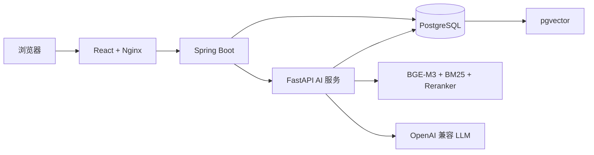

# Bio RAG

面向生物信息学文档的自托管 RAG 问答系统。上传 PDF、DOCX、HTML、Markdown 等资料后，Bio RAG 会完成文档解析、切分、向量化、混合检索和重排序，并生成带原文引用、页码和关联图片的回答。


[快速开始](#快速开始) · [使用流程](#使用流程) · [核心能力](#核心能力) · [系统架构](#系统架构) · [本地开发](#本地开发) · [常见问题](#常见问题)

## 快速开始

### 准备条件

- Docker Desktop，或 Docker Engine + Docker Compose v2
- 一个兼容 OpenAI API 格式的 LLM 服务，例如阿里云百炼 Qwen
- 能够访问 GHCR；模型下载默认使用 `hf-mirror.com`，也可以在 `.env` 中替换
- NVIDIA GPU 为可选项，CPU 模式可以直接运行

### 1. 获取项目

```bash
git clone https://github.com/Ymomo178/Bio_RAG.git
cd Bio_RAG
```

复制环境变量模板。

Windows PowerShell：

```powershell
Copy-Item .env.example .env
```

macOS / Linux：

```bash
cp .env.example .env
```

### 2. 配置 LLM 和管理员

打开 `.env`，至少填写以下项目：

```env
LLM_PROVIDER=qwen
LLM_BASE_URL=https://你的服务地址/compatible-mode/v1
LLM_API_KEY=你的 API Key
LLM_MODEL=你的模型名称
APP_ADMIN_EMAIL=你的管理员邮箱
```

使用 `APP_ADMIN_EMAIL` 对应的邮箱注册或登录后，该账号会获得管理员权限。不要把包含真实密钥的 `.env` 提交到 Git。

### 3. 一键启动

普通电脑使用 CPU 镜像：

```bash
docker compose -f docker-compose.images.yml up -d
```

已经配置 Docker NVIDIA GPU 支持时，使用 CUDA 12.4 镜像：

```bash
docker compose -f docker-compose.images.yml -f docker-compose.gpu.yml up -d
```

等待四个容器均显示为 `healthy`：

```bash
docker compose -f docker-compose.images.yml ps
```

然后访问 [http://localhost:5173](http://localhost:5173)。

> 首次问答或首次上传文档时，系统需要下载 BGE-M3 和 BGE Reranker 模型，耗时取决于网络速度。模型会保存在 Docker 数据卷中，后续启动会直接复用。

## 使用流程

1. 注册账号并登录。使用 `APP_ADMIN_EMAIL` 注册的账号同时拥有管理员权限。
2. 创建知识库，按需要设置为私有或公开；管理员还可以维护系统内置知识库。
3. 上传文档并等待状态变为可用。当前支持 `PDF`、`DOCX`、`HTML`、`MD/MDX`、`RST` 和 `TXT`。
4. 新建会话，同时选择一个或多个知识库，然后开始提问。
5. 在回答下方查看引用来源、章节、页码；明确询问图片或图表时，可以查看文档中关联的原图。

新部署不会附带仓库作者本地的原始文档和个人数据，请在网页中创建知识库并上传自己的资料。

## 核心能力

- **完整文档入库流程**：提取正文、标题层级、表格和图片，生成可追溯文本块并写入 pgvector。
- **混合检索**：BGE-M3 语义向量召回与 BM25 关键词召回并行执行，通过 RRF 融合后交给 BGE Reranker 重排。
- **可验证回答**：知识库回答返回来源、章节、页码和证据分数，引用会映射回真实文本块。
- **原图返回**：PDF、DOCX 和网页中的图片与文本块关联，用户索要图片时可随检索结果展示原图。
- **多轮对话**：保存会话记录，并将包含“它”“这个方法”等指代的问题结合上下文改写后再检索。
- **多知识库问答**：一次会话可选择多个知识库；不同用户、知识库和会话之间保持权限隔离。
- **知识库共享**：用户可以维护私有或公开知识库，其他用户可以使用公开知识库进行问答。
- **管理员管理**：管理员可以管理用户，并维护所有用户可用的系统内置知识库。
- **无精确证据兜底**：证据低于阈值时，明确提示未命中知识库，再由 LLM 基于通用知识回答。
- **OpenAI 兼容接口**：LLM 层可连接 Qwen、DeepSeek 等提供 OpenAI 兼容 API 的模型服务。

## 系统架构



浏览器只访问 Web 服务。Nginx 将 `/api` 请求转发给 Spring Boot，Java 后端负责用户、权限、知识库、文档和会话，Python 服务负责文档处理、检索、重排和回答生成。

一次问答的主要链路：

```text
用户问题 + 会话历史
        ↓
上下文改写为独立问题
        ↓
BGE-M3 向量检索 + BM25 关键词检索
        ↓
RRF 融合 + BGE Reranker 重排序
        ↓
证据阈值判断
        ↓
知识库证据增强回答 / LLM 通用知识兜底
```

## 镜像版本

| 服务 | 镜像标签 | 说明 |
| --- | --- | --- |
| Web | `ghcr.io/ymomo178/bio-rag-web:latest` | React 静态资源与 Nginx |
| Java | `ghcr.io/ymomo178/bio-rag-backend-java:latest` | Spring Boot 业务后端 |
| AI CPU | `ghcr.io/ymomo178/bio-rag-ai-service:latest` / `:cpu` | 默认版本，无需 NVIDIA GPU |
| AI GPU | `ghcr.io/ymomo178/bio-rag-ai-service:cuda` | CUDA 12.4，需 NVIDIA 容器运行时 |

`docker-compose.images.yml` 默认使用 CPU 版。叠加 `docker-compose.gpu.yml` 后会自动切换到 `cuda` 标签，并将 Embedding 与 Reranker 设备设置为 GPU。

## 配置说明

常用配置位于 `.env`：

| 环境变量 | 用途 | 示例或默认值 |
| --- | --- | --- |
| `LLM_BASE_URL` | OpenAI 兼容 API 根地址 | 必填 |
| `LLM_API_KEY` | LLM 服务密钥 | 必填 |
| `LLM_MODEL` | 对话模型名称 | 必填 |
| `APP_ADMIN_EMAIL` | 管理员账号邮箱 | 必填 |
| `POSTGRES_PASSWORD` | PostgreSQL 密码 | 本地默认为 `biorag_dev` |
| `HF_ENDPOINT` | Hugging Face 模型下载地址 | `https://hf-mirror.com` |
| `MAX_FILE_SIZE` | 单个上传文件大小限制 | `25MB` |
| `MIN_EVIDENCE_SCORE` | 使用知识库证据的最低重排分数 | `0.85` |
| `SESSION_COOKIE_SECURE` | 是否仅通过 HTTPS 发送 Session Cookie | 本地 HTTP 为 `false` |

本地开发使用 `localhost` 连接数据库；Compose 会在容器内部自动改用服务名 `postgres`，无需手动修改 `DB_URL` 或 `AI_DATABASE_URL`。

## 数据持久化

| 数据 | 保存位置 |
| --- | --- |
| 用户、会话、知识库、文档元数据和向量 | Docker 卷 `postgres_data` |
| BGE-M3 与 Reranker 模型缓存 | Docker 卷 `model_cache` |
| 用户上传的原始文件 | 项目目录 `uploads/` |
| 规范化文档和图片资产 | 项目目录 `artifacts/` |

停止服务不会删除数据：

```bash
docker compose -f docker-compose.images.yml down
```

`docker compose down -v` 会删除数据库和模型数据卷，请仅在确定需要清空数据时使用。

## 常用命令

查看状态和日志：

```bash
docker compose -f docker-compose.images.yml ps
docker compose -f docker-compose.images.yml logs -f ai-service
docker compose -f docker-compose.images.yml logs -f backend-java
```

拉取最新镜像并更新：

```bash
docker compose -f docker-compose.images.yml pull
docker compose -f docker-compose.images.yml up -d
```

验证 GPU 是否被 PyTorch 识别：

```bash
docker compose -f docker-compose.images.yml -f docker-compose.gpu.yml exec ai-service python -c "import torch; print(torch.cuda.is_available(), torch.cuda.get_device_name(0))"
```

## 本地开发

完整容器化运行优先使用上面的快速开始。需要分别调试服务时，安装：

- Java 21
- Python 3.12
- Node.js 20+
- Docker Desktop，用于 PostgreSQL + pgvector

先启动数据库：

```bash
docker compose up -d postgres
```

启动 Java 后端：

```powershell
cd backend-java
.\mvnw.cmd spring-boot:run
```

首次准备并启动 Python AI 服务（CPU 示例）：

```powershell
cd ai-service-python
python -m venv .venv
.\.venv\Scripts\python.exe -m pip install "torch==2.6.0" --index-url https://download.pytorch.org/whl/cpu
.\.venv\Scripts\python.exe -m pip install -e ".[embedding,service,dev]"
.\.venv\Scripts\biorag-api.exe
```

启动前端：

```powershell
cd web
npm ci
npm run dev
```

服务默认地址：

| 服务 | 地址 |
| --- | --- |
| Web | `http://localhost:5173` |
| Java | `http://localhost:8080` |
| Python | `http://localhost:8000` |
| PostgreSQL | `localhost:5432` |

运行测试：

```powershell
cd backend-java
.\mvnw.cmd test

cd ..\ai-service-python
.\.venv\Scripts\python.exe -m pytest -q

cd ..\web
npm run build
```

也可以直接从源码构建全部容器：

```bash
docker compose up -d --build
```

## 项目结构

```text
Bio_RAG/
├── web/                       # React 网页端和 Nginx 配置
├── backend-java/              # Spring Boot 业务后端
├── ai-service-python/         # FastAPI、文档处理和 RAG 检索
├── infra/postgres/            # pgvector 初始化脚本
├── data/evaluation/           # 检索与无答案评测集
├── reports/                   # 检索评测报告
├── docker-compose.images.yml  # 预构建镜像一键启动
├── docker-compose.gpu.yml     # NVIDIA GPU 覆盖配置
└── docker-compose.yml         # 本地源码构建配置
```

仓库不会提交 `.env`、原始文档、上传文件、解析产物、向量索引和本地模型缓存。

## 常见问题

### 拉取 GHCR 镜像时出现 `401` 或 `denied`

确认三个 GHCR Package 已公开。如果使用私有 Package，需要先执行 `docker login ghcr.io`。

### 拉取镜像时出现 `EOF` 或 `Connection reset`

这通常是 Docker Desktop 到 GHCR 的网络或代理问题。确认 Docker Desktop 的代理配置与系统网络一致，重启 Docker Desktop 后单独运行 `docker pull` 验证。

### 端口 `8080`、`8000` 或 `5173` 已被占用

在 `.env` 中修改对应的 `JAVA_PORT`、`PYTHON_PORT` 或 `WEB_PORT`，然后重新启动 Compose。

### 页面提示“AI 回答服务暂时不可用”

先检查容器状态和日志：

```bash
docker compose -f docker-compose.images.yml ps
docker compose -f docker-compose.images.yml logs --tail=200 ai-service
docker compose -f docker-compose.images.yml logs --tail=200 backend-java
```

重点确认 LLM 配置完整、PostgreSQL 健康、模型下载没有失败，并检查 Python 服务是否因内存不足退出。

### 第一次问答很慢

首次请求会下载 Embedding 和 Reranker 模型并加载到内存。下载完成后模型会保存在 `model_cache` 卷中，后续启动和问答会更快。

## 免责声明

Bio RAG 用于生物信息学资料检索和辅助问答。模型回答可能存在错误；涉及实验设计、临床医学或其他高风险决策时，请以原始文献、官方文档和专业人员判断为准。
